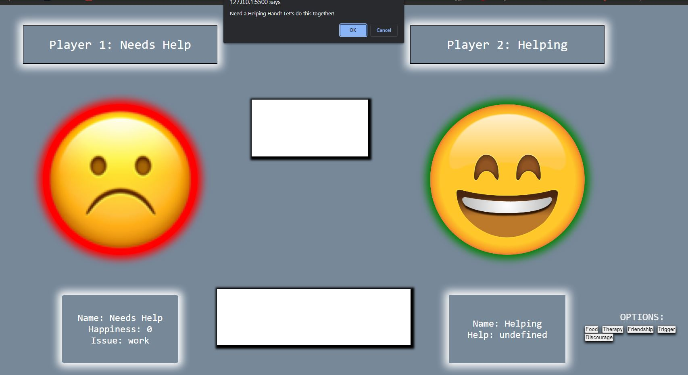
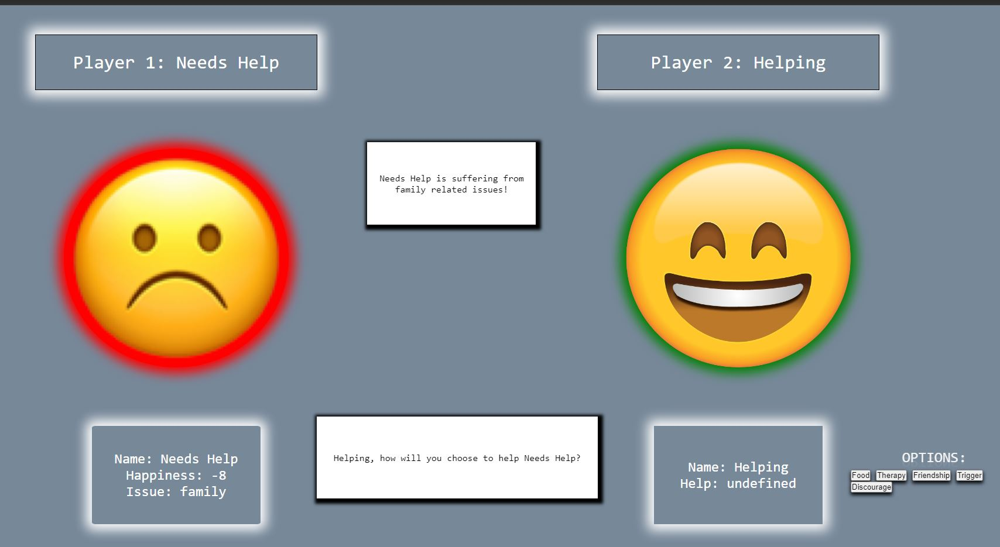
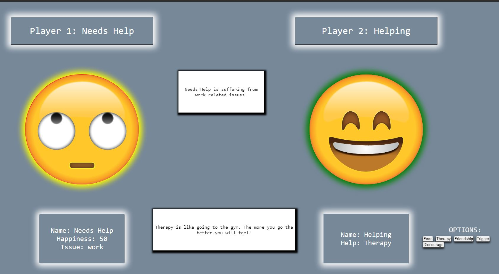
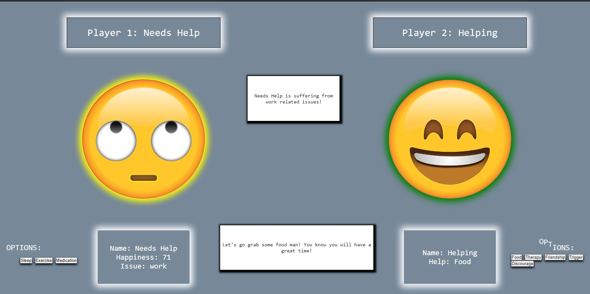
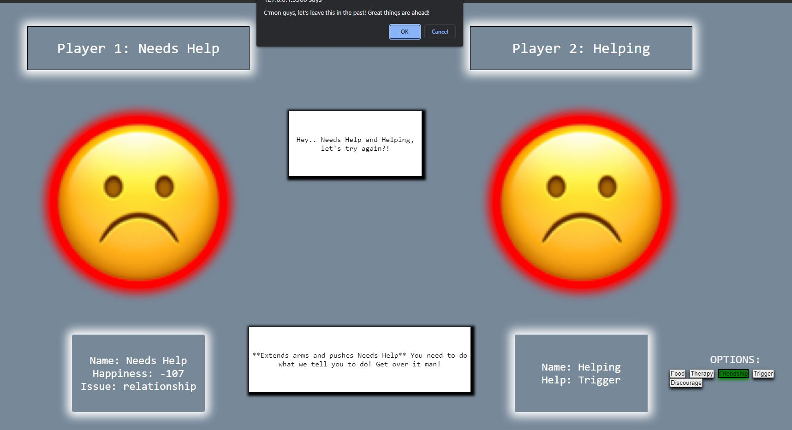
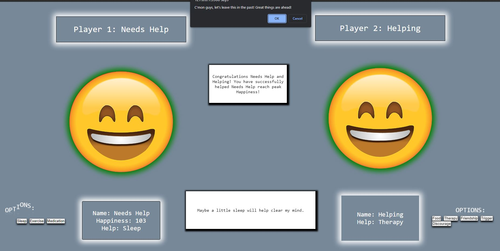

# Helping Hand

## Description

This is a custom game designed with a special friend in mind.

## Backstory

While on vacation in Norway with my family, I recieved a call that I never expected to receive. It was my close friend's father... He was contacting me to let me know that my friend's health was dimenishing. Obviously I initially began to somewhat panic, but remained calm enought to ask what was going on.. My friend, whom typically lights up any room he walks into with his great personality and positivity, had not spoken, eaten, and/or left his house in four days! Luckily he was still living, but he was refusing medical attention and his family could not convince him otherwise. They feared the worse and got his worst (but not the worst.. thankfully!). They pleaded for help, but I was 5,100 miles away. My vacation was nearing an end, so I decided to get my flight plans changed and directed to San Franscisco where they reside. Upon arrival, my friend that had not left his house, eaten, or spoken to anyone in four days, walked outside to greet me at the door! But something was still different about him.. He was completely non-verbal and still refusing medical attention. I spent the first three days in San Francisco trying to figure out how to help my friend. After countless attempts, I was able to get him some help and he was diagnosed with clinical depression. Not to mention, the early part of those days, I had to remain focused, as I am currently attending PerScholas' Software Engineering course. This particular week just happened to be the week that we were preparing for the dreaded "Project Week". I struggled with choosing which type of project I would like to attempt. So, I decided to develop a game that would help me communicate with my friend. No speaking is required.

## Technologies 

HTML, JavaScript, and CSS

## Challenges

Some of the technical challenges included:

- Removing and replacing prompts, alerts, & confirms
- Determining player turns
- "Infinite" loops
- Updating the DOM correctly

## Future Implementations

- Adding friendship level property to Player 2. Then using it to determine how effective Player 2's help is. The higher the friendship level, the stronger the help.
- Better player turn tracking
- More personalized responses
- Refactor code a lot!

## Installation

Fork the repo into your repository.

## Gameplay

Start of game after player names have been input.

Player 1's issue is auto-generated. While Player 1 happiness is < 50, Player 1's face remains unchanged. Player 2 chooses how to help and Player 1's issue is listed on the board in the center.

First condition has been met and Player 1's face has been changed.

Next condition has been met (while Player 1's happiness >= 70). New options for Player 1 to begin helping themself heal. Stats block has also been modified to show "Help" instead of "Issue".

Player 1 has reached the lowest level of Happiness. Player 2's face has changed. Game will reset or close depending on options chosen.

Player 1 has reached peak happiness. Game (window) closes. 

## Link
Play [Helping Hand](https://ncrawford22.github.io/helpingHand/ "Game Link")!

## License

MIT